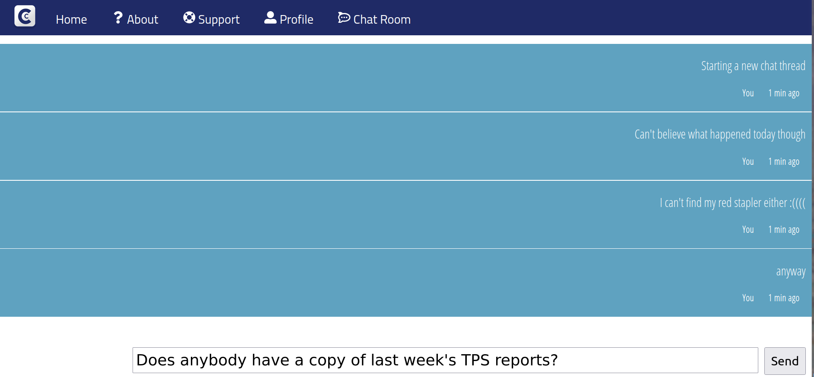

# chatty

Real time chat app created in React. Currently a W.I.P

## Why this app as created:

Proof of concept: I wanted to create a small example of a chat app utilizing Websockets and minimal U.I elements

## How to use:

1. Clone repo into desired directory `git clone https://github.com/Toughee/chatty.git` or `gh repo clone Toughee/chatty`
2. Run `npm install` in your terminal to install all app node modules and dependencies
3. Run `yarn start` in your terminal to run app on http://localhost:3000/

## Testing tools used for app:

-   React Testing library
-   Jest
-   Cypress
-   TravisCI
-   CircleCI

## Project resources:

-   [Current roadmap for app](https://github.com/Toughee/chatty/projects/1)
-   [Wiki page for app](https://github.com/Toughee/chatty/wiki)
-   [Documentation for project contributors](https://github.com/Toughee/chatty/tree/main/docs)

### Completed app tasks:

-   [x] Include CircleCI and Travis-CI inside project
-   [x] Better U/I scheme for app

### Future app goals:

-   [ ] Develop tests for each React component
-   [ ] Working chat for local users
